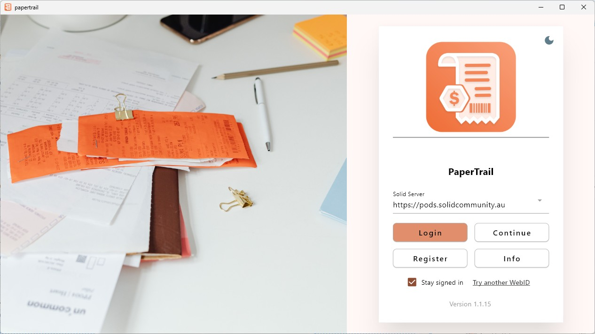
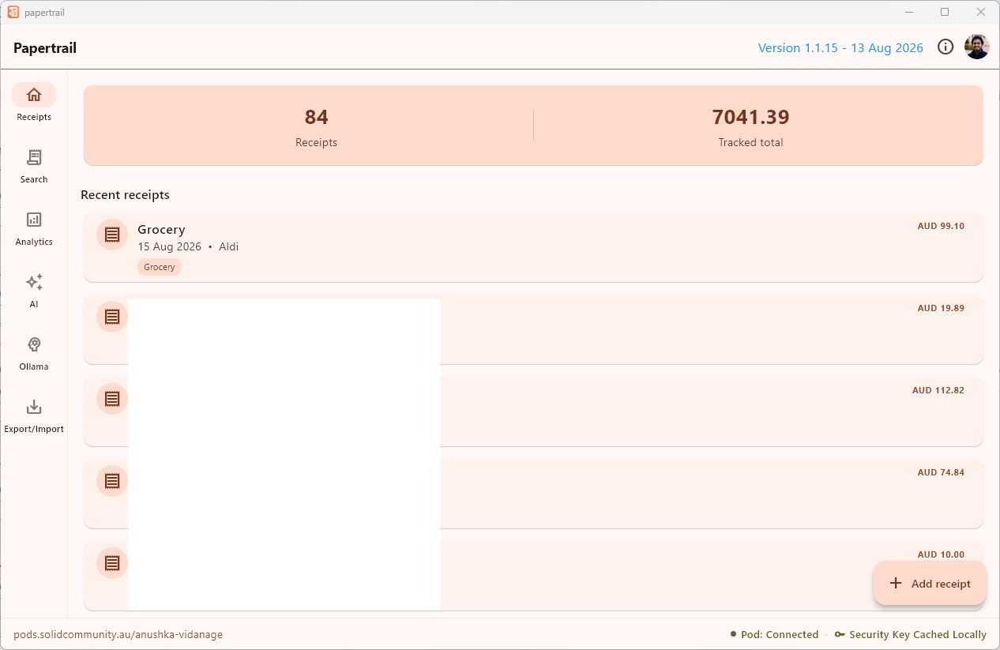
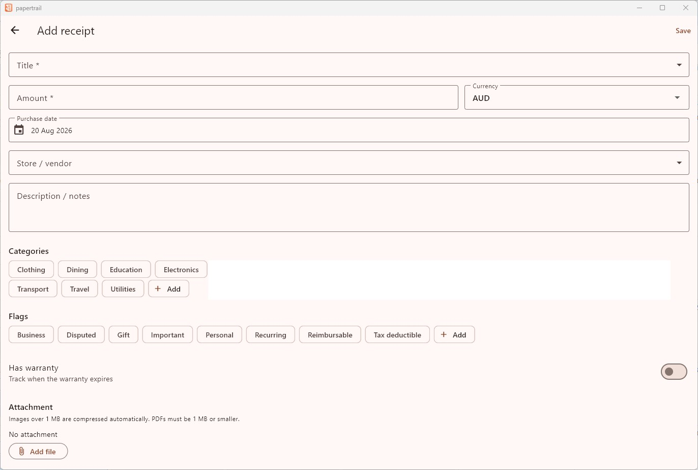
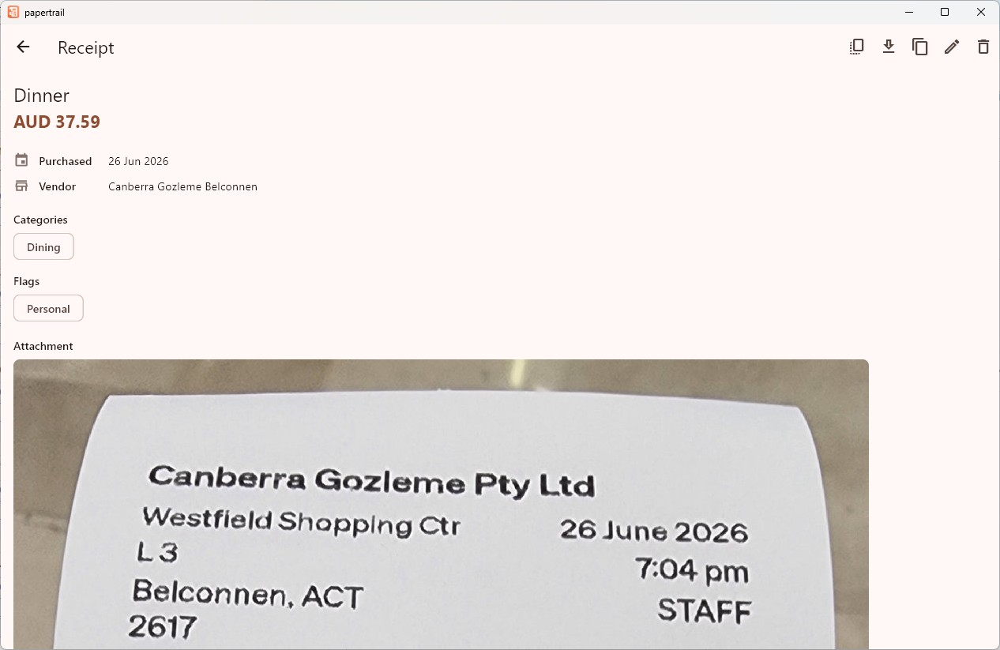
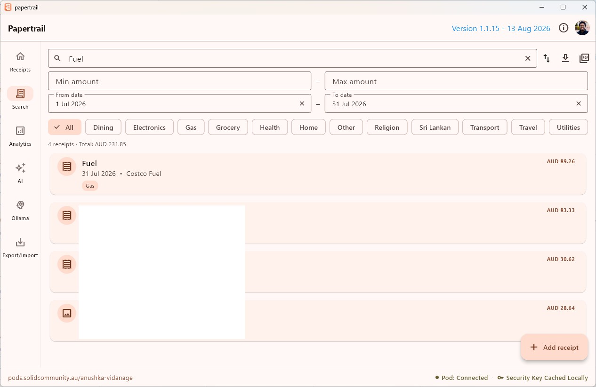
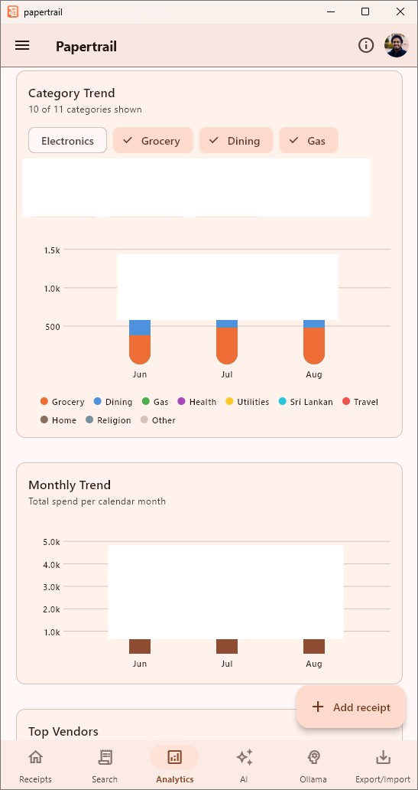
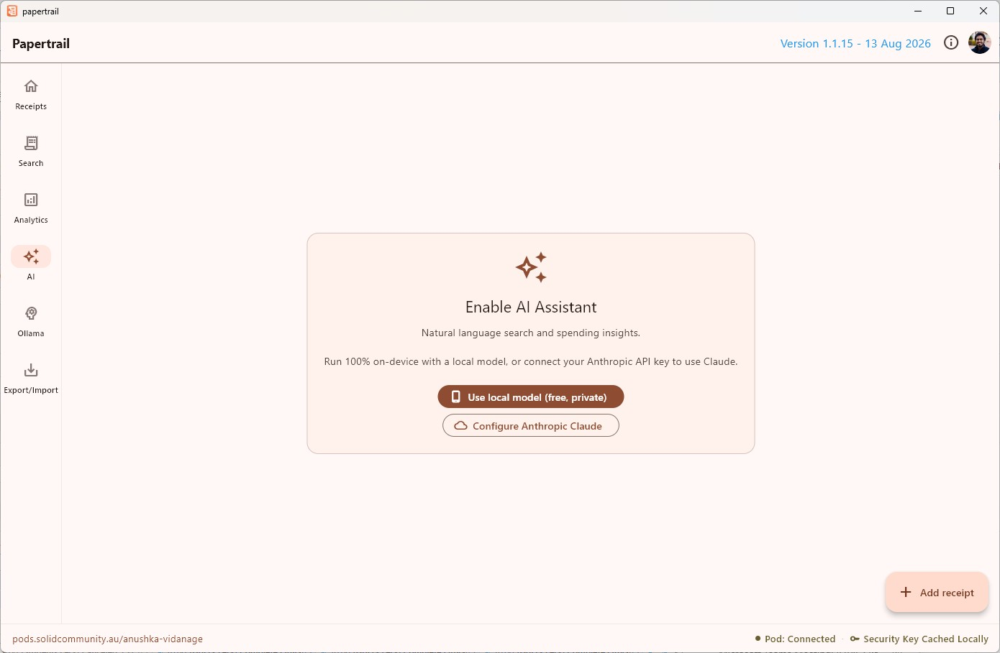
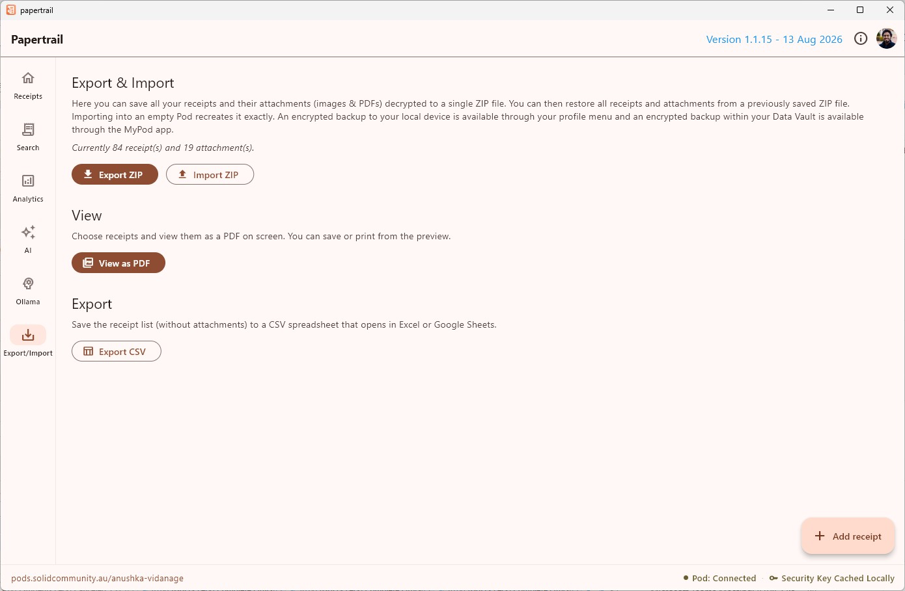

# Papertrail - Track your purchase receipts on your own Solid Pod

**Keep every purchase receipt, warranty, and attachment privately in
your own [Solid](https://solidproject.org) Pod.**

Authored by Anushka Vidanage. Licensed under the GNU GPL v3.

<!-- markdownlint-disable MD013 -->
[](https://flutter.dev)
[](https://dart.dev)

[](https://raw.githubusercontent.com/anushkavidanage/papertrail/dev/LICENSE)
[](https://github.com/anushkavidanage/papertrail/blob/dev/CHANGELOG.md)
[](https://github.com/anushkavidanage/papertrail/commits/dev/)
[](https://github.com/anushkavidanage/papertrail/issues)
<!-- markdownlint-enable MD013 -->

## Introduction

Papertrail is a demonstrator app for Solid personal online data stores
(Pods) written in [Flutter](https://flutter.dev/) and
[Dart](https://dart.dev/). Using this app you can keep track of every
purchase receipt and its informations such as
the amount, date, store, category, and warranty,
together with a photo or PDF of the receipt itself. It is a
cross-platform app that runs on desktop, mobile, and web.

All of your receipt data, and any attached photos or PDFs, is
encrypted and saved on your Pod hosted on a
[Solid server](https://github.com/CommunitySolidServer/). You maintain
full control over your data, not the app developer or anyone else. So
there is no Papertrail server. You can even host your Pod server and
point the app to it and it will work.

This app is built as part of a suite of demonstrator apps developed by
the research team at the
[ANU Software Innovation Institute](https://sii.anu.edu.au) (SII). To
access more apps like this using Solid Pod technology please go to the
[Solid Community AU](https://solidcommunity.au/) website.

## Features

- **Solid login** - authenticate against any Solid server; your data
  lives in your Pod, not on a Papertrail server.
- **Add / edit / delete receipts** with:
  - title, amount + currency, purchase date, store/vendor, free-text
    notes;
  - one or more **categories** (Grocery, Electronics, Dining, … or
    your own);
  - arbitrary **flags** (Tax deductible, Reimbursable, Important, …
    or your own);
  - optional **warranty** tracking with an expiry date and automatic
    "expiring soon" notifications.
- **Attachments** - a primary photo or PDF plus additional
  attachments per receipt, uploaded to your Pod with the encrypted
  large-file API. Capture directly from the camera, with automatic
  image compression.
- **Search, filter, and sort** - full-text search plus filters by
  category, amount range, and date, with multiple sort orders.
- **Bulk actions** - multi-select receipts for bulk delete, or
  duplicate an existing receipt as a starting point for a new one.
- **Backup & export** - export your receipts (and attachments) to a
  portable archive and restore from one, plus CSV export for
  spreadsheets.
- **Analytics**:
  - spending by category (donut chart);
  - category trend over time, with per-category filter chips so you
    can, for example, hide "Electronics" and focus on "Grocery",
    "Dining", and "Gas";
  - monthly spending trend;
  - top vendors, with visit frequency, average spend per visit, and a
    "New" badge for vendors you've only started buying from recently;
  - upcoming warranty expirations.
- **AI assistant** - natural-language receipt search and a spending
  insights chat, running either fully on-device (private, no network
  calls) or via your own Anthropic Claude API key. An optional Ollama
  chat screen lets you point the assistant at a local Ollama server
  instead. Note that if you are running a local model point the app
  to that model it can get very resource intensive depending on the
  model you use.

## Getting Started

### Obtaining a Pod

To use the app you will need your own Pod hosted on a Solid server.
To try it out you can get yourself a Pod at SII's experimental
server, the Australian Solid Community Pod Server
<!-- markdownlint-disable MD013 -->
([register here](https://pods.solidcommunity.au/.account/login/password/register/)),
<!-- markdownlint-enable MD013 -->
or any one of the available
[Pod Providers](https://solidproject.org/users/get-a-pod) world wide.

### Try it in your browser

Papertrail is hosted at
[papertrail.solidcommunity.au](https://papertrail.solidcommunity.au) —
open it and log in with your Pod, no install required.

### Install the app locally

Prebuilt installers for the latest release are published via
[Solid Community AU](https://solidcommunity.au):

- **Android** as
  [aab](https://solidcommunity.au/installers/papertrail.aab) or
  [apk](https://solidcommunity.au/installers/papertrail.apk);
- **GNU/Linux** as
  [deb](https://solidcommunity.au/installers/papertrail_amd64.deb),
  [snap](https://solidcommunity.au/installers/papertrail_amd64.snap),
  or [zip](https://solidcommunity.au/installers/papertrail-linux.zip);
- **macOS** as
  [dmg](https://solidcommunity.au/installers/papertrail-macos.dmg) or
  [zip](https://solidcommunity.au/installers/papertrail-macos.zip);
- **Windows** as
  [inno](https://solidcommunity.au/installers/papertrail-windows-inno.exe)
  or
  [zip](https://solidcommunity.au/installers/papertrail-windows.zip).

### Run from source

```bash
flutter pub get
flutter run            # choose a device (Windows/macOS/Linux/Android/iOS/web)
```

*Note*: The on-device AI assistant is only available on Android, iOS, macOS,
and Windows. It is not offered on web or Linux. Every other feature
works across all supported platforms.

#### Solid OIDC configuration

`lib/constants/app_config.dart` ships with the publicly published
example client registration so login works out of the box during
development. **For a production release**, register your own client
profile document and replace `clientId` / `redirectUris` with your
own values. On mobile you will also need to register your redirect
custom-scheme in the Android manifest / iOS Info.plist so the OIDC
redirect returns to the app; desktop uses a `localhost` loopback and
needs no extra setup.

## Usage

At startup you will first need to log in to your Pod by clicking the
`Login` button. You can register for a Pod using the `Register`
button if you don't have one yet.

<!-- markdownlint-disable MD033 -->
<div style="left">
  
</div>
<!-- markdownlint-enable MD033 -->

Once logged in, the home tab gives you an overview of your receipt
count, tracked total, and most recent purchases.

<!-- markdownlint-disable MD033 -->
<div style="left">
  
</div>
<!-- markdownlint-enable MD033 -->

Tap "Add receipt" to record a purchase: title, amount, vendor,
categories, flags, an optional warranty date, and a photo or PDF
attachment captured from your camera or picked from storage.

<!-- markdownlint-disable MD033 -->
<div style="left">
  
</div>
<!-- markdownlint-enable MD033 -->

Open any receipt to see its full detail, including every attachment
and, when applicable, its warranty status.

<!-- markdownlint-disable MD033 -->
<div style="left">
  
</div>
<!-- markdownlint-enable MD033 -->

The receipts tab supports full-text search plus filters by category,
amount range, and date, with several sort orders, and multi-select
for bulk delete.

<!-- markdownlint-disable MD033 -->
<div style="left">
  
</div>
<!-- markdownlint-enable MD033 -->

The analytics tab breaks your spending down by category and vendor:
a category donut and trend chart (with filter chips to focus on just
the categories you care about), a monthly trend, top vendors with
visit frequency and a "New" badge, and upcoming warranty expirations.

<!-- markdownlint-disable MD033 -->
<div style="left">
  
</div>
<!-- markdownlint-enable MD033 -->

Ask the AI assistant to find receipts or answer spending questions in
plain language. Running fully on-device for privacy, or via your own
Anthropic Claude API key for more capable answers.

<!-- markdownlint-disable MD033 -->
<div style="left">
  
</div>
<!-- markdownlint-enable MD033 -->

Finally, export your receipts and attachments to a backup archive at
any time, and restore from one on a new device.

<!-- markdownlint-disable MD033 -->
<div style="left">
  
</div>
<!-- markdownlint-enable MD033 -->

## How data is stored on the Pod

Everything lives under `papertrail/data/` in the Pod:

<!-- markdownlint-disable MD013 -->
| What               | Where                           | Format                                                                                                                         |
| ------------------ | ------------------------------- | ------------------------------------------------------------------------------------------------------------------------------ |
| Receipt            | `receipts/<uuid>.ttl`           | Encrypted Turtle. Human-readable triples plus a canonical base64-encoded JSON payload (`pt:data`) for lossless round-tripping. |
| Primary attachment | `attachments/<uuid>`            | Encrypted blob via the Solid large-file API.                                                                                   |
| Extra attachment   | `attachments/<uuid>_e<extraId>` | Encrypted blob via the Solid large-file API.                                                                                   |
<!-- markdownlint-enable MD013 -->

The receipts container is listed with `getResourcesInContainer`; each
file is read with `readPod` and parsed back into a `Receipt`. Receipt
files are fetched with bounded concurrency so the app stays responsive
even with a large number of receipts.

<!-- ## Project layout

```console
lib/
  main.dart                       app entry point
  app.dart                        SolidThemeApp → SolidLogin → HomeShell
  constants/app_config.dart       app id, OIDC client config, categories, flags
  models/
    receipt.dart                  the Receipt domain model
    ai_model_config.dart          local AI model configuration
  services/
    receipt_serializer.dart       Receipt ⇄ Turtle
    pod_service.dart              read/write/delete on the Pod (solidpod)
    receipt_store.dart            shared in-memory state (ChangeNotifier)
    backup_service.dart           export / restore of receipts and attachments
    notification_service.dart     local warranty-expiry notifications
    receipts_pdf.dart             PDF generation for receipts
    ai_service.dart               on-device / Anthropic AI backend lifecycle
  screens/
    home_shell.dart                navigation shell + add-receipt FAB
    recent_receipts_view.dart      home overview + recent list
    all_receipts_view.dart         searchable / filterable / sortable list
    add_edit_receipt_screen.dart   the receipt form
    receipt_detail_screen.dart     detail view + attachment viewer
    analytics_view.dart            category, vendor, and warranty analytics
    ai_assistant_view.dart         AI-powered search and insights chat
    ollama_chat_screen.dart        chat against a local Ollama server
    backup_view.dart               export / restore UI
  widgets/
    receipt_card.dart              list item
    locked_backdrop.dart           backdrop shown behind the key prompt
  utils/
    formatting.dart                date / money helpers
    csv_exporter.dart              CSV export
``` -->

## Contributing

Contributions are welcome. Visit
[GitHub](https://github.com/anushkavidanage/papertrail) to submit an
issue or, even better, fork the repository yourself, update the code,
and submit a Pull Request. Coding documentation is
[available](https://solidcommunity.au/docs/papertrail/).

We make this project available for free, so if you appreciate the app
then please show some support and tap the star on
[GitHub](https://github.com/anushkavidanage/papertrail).

## License

Papertrail is licensed under the
[GNU General Public License v3](LICENSE).
